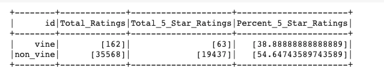
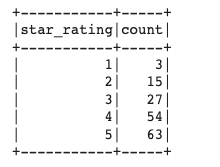
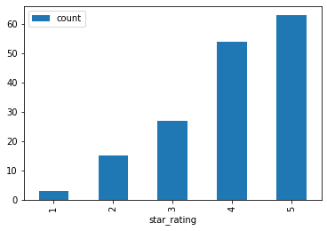
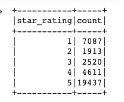
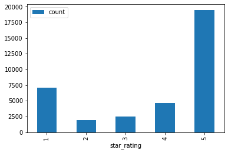

# Big Data Analysis

## Overview

Big data is becoming a significant factor for business intelligence and analysis as we collect more and more data from users and customers.  I can give insights into trends and can allow businesses to identify new opportunities to enhance their customer experience and provide opportunities to generate increased revenue.  Big data requires large demands on computing power and resources which has restricted these insights in the past however as large data centers have emerged and the advent of cloud computing has become scalable the opportunities to access this technology is no longer limited to large organizations that can afford the resources.  This project focuses on using ratings data from Amazon pet products to determine how ratings for users participating in the Vine program that invites trusted reviewers to provide feedback on products they sell.  This involves analyzing ratings data collected on pet products that includes Vine members and non-Vine members to determine if there is an observed difference in the number of 5-star ratings that are given for products sold on the Amazon website.  The analysis used PySpark to manage the analysis through Google Colab to conduct the analysis using Amazon Web Services (AWS) relational database and S3 services to manage the data transfer with our postgreSQL database.

---

## Results

The analysis of pet product sales produced from the Amazon review dataset contained a number of relevant categories to help with the analysis.  It included the product and product code as well as the customer ID along with the ratings given as well as the helpfulness of the ratings given.  The dataset also included a review ID, the date of the review and the comments added.  To conduct the analysis if an effect on ratings can be contributed to users that are in the Vine Program versus those who are not. This involved answering 3 main questions:

1. How many Vine reviews and non-Vine reviews are collected
2. How many reviews were 5-star reviews were posted from each group
3. What percentage of 5-star reviews for each group were observed. 

The findings for each of these questions were answered during the process of this analysis

1. The product reviews were selected to only products with 20 reviews or more to increase the validity of the results.  The Vine reviews made up a total of 162 reviews where non-Vine reviews totaled 35568 reviews.  As the Vine reviewers are selected by invitation only, the wide variation of the number of reviews from each group is in line with what would be expected.

2. The total number of 5-star reviews for the pet products reviewed by Vine Program members was 63 and non-Vine members gave 19437 5-star reviews on products in this category.  

3. To determine the proportion of 5-star reviews given from the Vine and non-Vine groups the total ratings was divided by the number of 5-star ratings to show the percentage of 5-star reviews per group.  From this we observed 38.9% of the reviews for Vine members were given 5-stars versus 54.6% for non-Vine members.  

Below is a data frame constructed during the analysis using PySpark to isolate and calculate the values presented above.

---

## Summary

From this analysis it is evident that the Vine reviews give 15.7% less 5-star reviews compared to the non-Vine members.  This suggests that the ratings given by reviewers that are a part of the Vine Program give lower reviews on products in this category.  As the Vine Program members are selected by Amazon based on the quality and reliability of their reviews it suggests that they are more critical of the products and provide what Amazon determines to be a true representation of the quality of the product.  The lower number of 5-star reviews provided by Vine members supports this. This can be supported further by looking at the overall distribution of ratings from each group to identify trends in the ratings given.  This is displayed in the distributions observed below that highlights how each groups ratings were distributed in the 1-5 star ratings used on Amazon reviews.

<table>
    <tr>
        <td>Frequency of Star Ratings from Vine Program</td>
        <td>Distribution of Star Ratings from Vine Program
    </tr>
    <tr>
        <td></td>
        <td></td>
    </tr>
</table>

<table>
    <tr>
        <td>Frequency of Star Ratings from non-Vine Program</td>
        <td>Distribution of Star Ratings from non-Vine Program
    </tr>
    <tr>
        <td></td>
        <td></td>
    </tr>
</table>

These distributions show that there is an almost linear relationship between the frequency of the ratings given and the star ratings given by the Vine Program reviews.  This is contrasted with the non_Vine reviews that has peaks observed in the 1-star and 5-star reviews but a notable dip in the 2-4 star reviews given.  This can be investigated further by conducting a statistical analysis to determine if the differences observed between the two ratings groups are significantly different using ANOVA and t-Test statistics to test the hypothesis.

---

